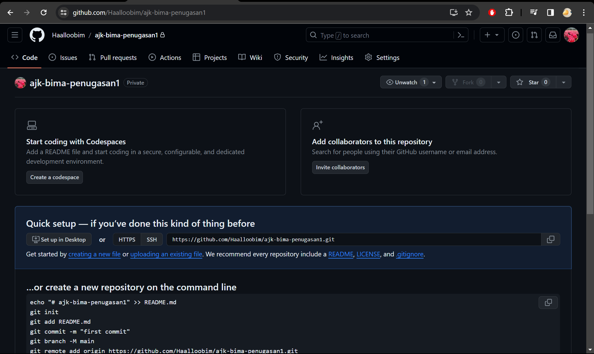
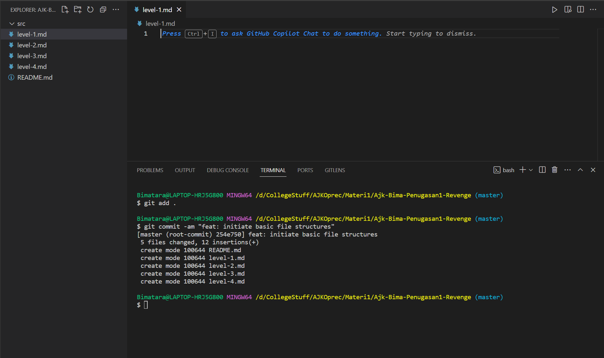

# Dokumentasi / Laporan Pengerjaan Penugasan GIT Level 1 [Back to Basic]

## By: Muhammad Bimatara Indianto / 5025221260

## List Tugas yang diberikan
1. Buat sebuah repository di GitHub. Nama repository dalam format ajk-[nama panggilan]-penugasan1. Repository ini juga sebagai tempat menaruh laporan pengerjaan untuk level selanjutnya.  
Contoh: ajk-xxx-penugasan1  
Struktur: 
    - /src			(Berisi kode pengerjaan level 1 kalian)
    - README.md		(Readme utama)
    - level-1.md		(Laporan level 1)
    - level-2.md		(Laporan level 2)
    - level-3.md		(Laporan level 3)
    - level-4.md		(Laporan level 4)
2. Implementasikan penggunaan branching yang terdiri dari **master**, **development**, **featureA**, dan **featureB**. Codebase dibebaskan.
3. Implementasikan intruksi git untuk push, pull, stash, reset, diff, dan merge. Adanya tambahan intruksi git selain yang disebutkan akan lebih baik.
4. Implementasikan sebuah penanganan conflict di branch development ketika setelah merge dari branch **featureA** lalu merge dari branch **featureB**.  
**Catatan**: conflict bisa terjadi jika kedua branch mengerjakan di file dan line code yang sama. Buatlah skenario sendiri.
5. Gunakan merge no fast forward.
   
## Penjelasan Alur Pengerjaan Penugasan 1 GIT Level 1 [Sesuai dengan Tugas]

### 1. Pembuatan Repository Git dan Github 
Pertama-tama, hal yang saya lakukan adalah membuat sebuah repository pada github sebagai wadah remote untuk local git yang akan digunakan nantinya. Hal ini dapat dilakukan langsung pada [Github](https://github.com/). Dapat dilihat pada gambar berikut.

Setelah melakukan hal tersebut, saya membuat sebuah folder yang memiliki _file structure_ sesuai dengan yang diinstruksikan. Kemudian, saya melakukan inisiasi git pada folder tersebut menggunakan command `git init`. Setelah itu, saya melakukan command `git add .` yang berguna untuk memasukkan semua perubahan file kedalam staging area. Setelah memasukkan ke dalam staging area, saya melakukan command `git commit -am <commit-message>` yang berfungsi untuk mencommit hal hal yang berada pada staging area. Dapat dilihat pada gambar berikut.

