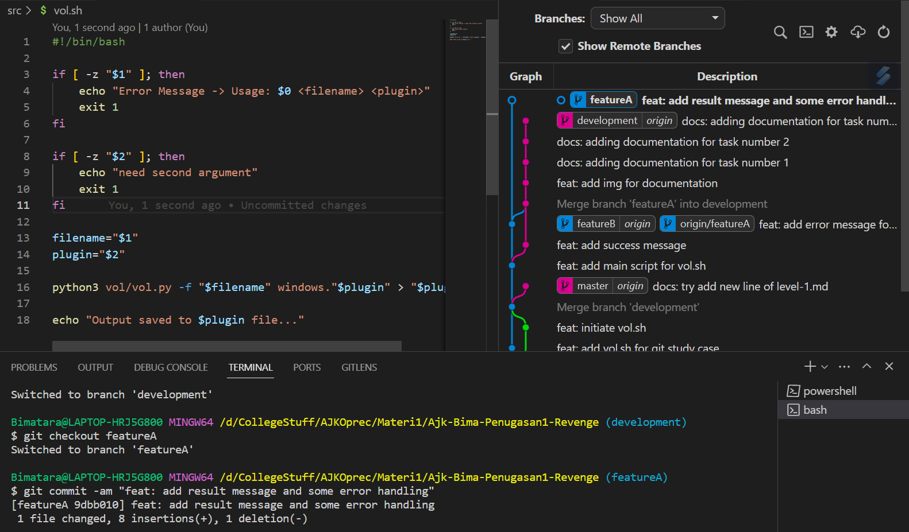
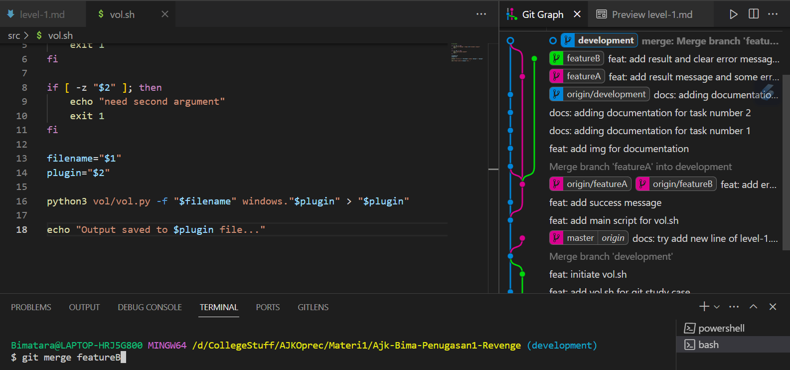

# Dokumentasi / Laporan Pengerjaan Penugasan GIT Level 1 [Back to Basic]

## By: Muhammad Bimatara Indianto / 5025221260

## List Tugas yang diberikan
1. Buat sebuah repository di GitHub. Nama repository dalam format ajk-[nama panggilan]-penugasan1. Repository ini juga sebagai tempat menaruh laporan pengerjaan untuk level selanjutnya.  
Contoh: ajk-xxx-penugasan1  
Struktur: 
    - /src			(Berisi kode pengerjaan level 1 kalian)
    - README.md		(Readme utama)
    - level-1.md		(Laporan level 1)
    - level-2.md		(Laporan level 2)
    - level-3.md		(Laporan level 3)
    - level-4.md		(Laporan level 4)
2. Implementasikan penggunaan branching yang terdiri dari **master**, **development**, **featureA**, dan **featureB**. Codebase dibebaskan.
3. Implementasikan intruksi git untuk push, pull, stash, reset, diff, dan merge. Adanya tambahan intruksi git selain yang disebutkan akan lebih baik.
4. Implementasikan sebuah penanganan conflict di branch development ketika setelah merge dari branch **featureA** lalu merge dari branch **featureB**.  
**Catatan**: conflict bisa terjadi jika kedua branch mengerjakan di file dan line code yang sama. Buatlah skenario sendiri.
5. Gunakan merge no fast forward.
   
## Penjelasan Alur Pengerjaan Penugasan 1 GIT Level 1 [Sesuai dengan Tugas]

### 1. Pembuatan Repository Git dan Github 
Pertama-tama, hal yang saya lakukan adalah membuat sebuah repository pada github sebagai wadah remote untuk local git yang akan digunakan nantinya. Hal ini dapat dilakukan langsung pada [Github](https://github.com/). Dapat dilihat pada gambar berikut.

Setelah melakukan hal tersebut, saya membuat sebuah folder yang memiliki _file structure_ sesuai dengan yang diinstruksikan. Kemudian, saya melakukan inisiasi git pada folder tersebut menggunakan command `git init`. Setelah itu, saya melakukan command `git add .` yang berguna untuk memasukkan semua perubahan file kedalam staging area. Setelah memasukkan ke dalam staging area, saya melakukan command `git commit -am <commit-message>` yang berfungsi untuk mencommit hal hal yang berada pada staging area. Dapat dilihat pada gambar berikut.

### 2. Implementasi Fitur Branching pada GIT
Untuk tugas yang kedua ini, ditugaskan untuk membuat 3 branch baru yang bernama `development`, `featureA`, dan `featureB`. Disini saya menggunakan piping command untuk membuat banyak branch dalam satu kali command. Berikut adalah command tersebut. `git branch development | git branch featureA | git branch featureB`. Kemudian saya menggunakan command `git branch --list` untuk menampilkan semua branch yang ada. Dapat dilihat pada gambar berikut. 

### 3. Implementasi Command-Command Pada GIT
Setelah saya membuat branch sesuai yang telah diinstruksikan, saya menghubungkan git local saya dengan git remote yaitu dengan Github. disini saya menggunakan command `git remote add <remote-name> <github-repo-link>` dilanjutkan dengan command `git branch -M <branch-name>` untuk menamai branch nya menjadi master dilanjutkan lagi menggunakan command `git push -u <remote-name> <branch-name>` command ini berfungsi untuk 'mendorong' content yang ada pada git local untuk berada pada remote repository sehingga content yang awalnya hanya ada pada local akan berada pada remote repository juga. Dapat dilihat pada gambar berikut. 

Setelah melakukan fitur `git push`, disini saya akan mengimplementasikan fitur `git pull`. Karena command `git pull` berfungsi sebaliknya dari `git push` yaitu 'menarik' content dari remote repository ke dalam local repository, saya berencana untuk merubah content dari remote terlebih dahulu kemudian baru melakukan `git pull`. Dapat dilihat pada gambar berikut. 

Setelah melakukan commit pada remote repository, saya menggunakan command `git status` pada local repository saya untuk mengetahui bagaimana kondisi local repository tersebut. Dapat dilihat status bertuliskan `your branch is behind 'origin' by 1 commit`. Untuk itu saya menggunakan command `git pull` untuk menyamakan commit antara local dan remote. Dapat dilihat pada gambar berikut. 

Setelah itu untuk memvisualisasikan branching, saya melakukan commit pada master kemudian berpindah ke branch lain menggunakan command `git checkout <branch-name>` setelah melakukan hal tersebut, saya melakukan commit  pada branch dev. Dapat dilihat pada gambar branch mulai terbentuk dikarenakan terdapat perbedaan commit pada branch dev dengan branch master. 

Kemudian saya akan mengimplementasikan command `git merge <target-branch>` yang berfungsi untuk menggabungkan dua branch yang ada. Dapat dilihat pada gambar berikut. 

Kemudian disini saya berencana untuk membuat branch yang ada pada local bisa dilihat pada remote juga. Disini saya menggunakan command sebelumnya yaitu `git push` dengan sedikit modifikasi untuk membuat local branch saya dapat dilihat/diakses pada remote repository. dengan command sebagai berikut: `git push <remote-name> <local-branch>:<remote:branch>` dengan catatan apabila remote branch belum ada maka github akan otomatis membuatkannya. Hal ini saya lakukan pada semua branch. Dapat dilihat pada gambar berikut. 

Setelah itu saya akan mengimplementasikan command `git diff <branch-name>` yang berfungsi untuk menampilkan hal apa saja yang berubah dibandingkan dengan branch lain. Disini saya berada pada branch `development` dan ingin melihat perbedaan dengan branch `master`. Dapat dilihat dari gambar berikut.

Setelah itu saya akan mengimplementasikan command `git reset` yang berfungsi untuk mengembalikan ke kondisi commit sebelumnya. Disini saya menggunakan command `git reset --hard HEAD~` untuk benar benar mengembalikan commit sebelumnya. Kasusnya dapat dilihat pada gambar berikut.  

Ketika saya melakukan perubahan pada sebuah branch dan langsung ingin berpindah ke branch lain pasti akan timbul sebuah error. Hal ini dapat diselesaikan dengan command `git stash` yang berfungsi untuk menyimpan perubahan pada suatu branch. Sehingga ketika melakukan `git checkout` tidak terjadi error. 

### 4. Implementasi Conflict Handling Pada GIT
Pada tugas 4, diinstruksikan untuk membuat sebuah kasus dimana pada saat merging akan terjadi kondisi conflict. Kondisi conflict ini akan terjadi ketika, user telah melakukan perubahan pada branch yang berbeda akan tetapi perubahan tersebut trajadi pada file dan line yang sama sehingga akan bertabrakan. Oleh karena itu untuk membuat kondisi conflict saya akan merubah file dan line yang sama pada branch `featureA` dan `featureB`. Berikut ini kondisi semula dari branch `featureA` dan `featureB`.

Kemudian saya melakukan `checkout` ke branch `featureA` dan melakukan perubahan, lalu saya commit. Hal ini juga saya lakukan pada branch `featureB`, lakukan perubahan pada file kemudian melakukan commit pada branch tersebut. Dapat dipastikan bahwa perubahan dari branch `featureA` harus berbeda dengan branch `development` dan perubahan pada branch `featureB` juga harus berbeda dengan branch `featureA`, karena yang nanti akan saya lakukan adalah `checkout develepment -> merge featureA -> merge featureB`. Dapat dilihat dari dua gambar berikut. 

Setelah melakukan hal tersebut, saya melakukan `git checkout develepment` kemudiian melakukan merging yang pertama dengan branch `featureA` dengan command `git merge featureA`. ketika melakukan command ini, conflict akan terjadi. Terdapat button `Resolve in merge editor` lalu tekan button tersebut. Dapat dilihat pada gambar dibawah. 

Kemudian kita diharuskan untuk menentukan content mana yang akan dipilih sebagai content final. Setelah menentukan hal tersebut, saya menekan button `Complete merge`. untuk menyelesaikan proses merging. Dapat dilihat pada gambar dibawah ini. 

Setelah itu hal terakhir yang dilakukan untuk proses merging pada branch `featureA` adalah melakuakn commit pada perubahan yang terjadi. Dapat dilihat pada gambar berikut. 

Setelah itu saya melakukan langkah langkah yang sama untuk proses `merge-conflict handling` seperti sebelumnya. Dapat dilihat pada gambar gambar berikut. 

### 5. Implementasi Command Merge No Fast Forward Pada GIT
Untuk melakukan command `merge no fast forward`. Saya melakukan 2 commit terlebih dahulu pada branch `featureB` kemudian juga melakukan push ke remote. Dapat dilihat pada gambar berikut.

Setelah itu saya melakukan `checkout` menggunakan command `git merge --no-ff featureB` untuk melakukan merge no fast forward dan melakukan push. Dapa dilihat pada gambar dibawah ini bahwa branch akan langsung bergabung ke branch `development`.

